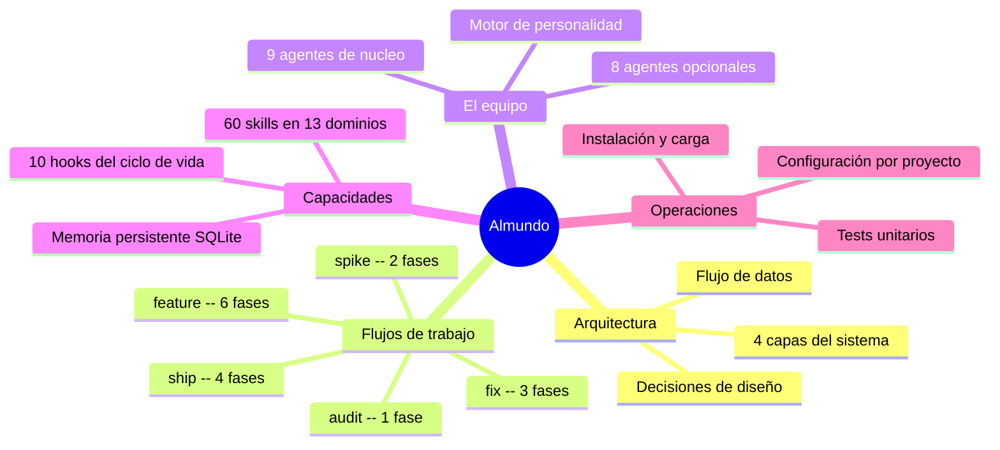

# Documentación técnica de Almundo

Esta documentación esta pensada para desarrolladores que necesitan entender como funciona el plugin Almundo por dentro: su arquitectura, sus decisiones de diseño, como se integra en Claude Code y como contribuir. No es documentación de usuario (eso esta en el [README del proyecto](../README.md)); es documentación de ingenieria interna.

El plugin se inspira en `alfred-dev`, y transforma el CLI en un equipo de 17 agentes especializados. Cada agente tiene un rol definido (producto, arquitectura, desarrollo, seguridad, QA, DevOps, documentación, gestion de proyecto, internacionalizacion), herramientas restringidas y quality gates infranqueables. El plugin se organiza en 4 capas (comandos, agentes, core Python, integración) que se coordinan a traves de un fichero de estado JSON y una base de datos SQLite para memoria persistente.

El código fuente es la referencia definitiva, pero esta documentación explica el **por que** detrás de cada decisión: por que Python y no JavaScript, por que SQLite y no JSON, por que 17 agentes y no uno solo, por que quality gates en cada transición. Un junior debe poder leer esta documentación de principio a fin y entender el proyecto sin ayuda externa.

---

## Mapa del proyecto

---

## Navegación

La documentación se organiza de lo general a lo específico. Se recomienda leer en el orden que aparece en la tabla, aunque cada fichero es autocontenido.

| Fichero | Descripción |
|---------|-------------|
| [architecture.md](architecture.md) | Las 4 capas del sistema, diagramas C4 y de secuencia, decisiones de diseño fundamentales |
| [flows.md](flows.md) | Los 5 flujos de trabajo con diagramas de estado, quality gates y formato de veredicto |
| [agents/README.md](agents/README.md) | Vision general del equipo de 17 agentes, modelo de colaboración, distribución de modelos |
| [skills.md](skills.md) | Catalogo de 60 skills organizados en 13 dominios con diagrama mindmap |
| [hooks.md](hooks.md) | Los 10 hooks que conectan Almundo IA con Claude Code, diagrama de secuencia, guia para crear nuevos |
| [memory.md](memory.md) | Memoria persistente: esquema SQLite, FTS5, servidor MCP, sanitizacion, el Bibliotecario |
| [configuration.md](configuration.md) | Detección de stack, fichero .local.md, niveles de autonomía, agentes opcionales, composicion dinámica de equipo |
| [installation.md](installation.md) | Cadena de carga de plugins en Claude Code, scripts de instalación, troubleshooting |
| [personality.md](personality.md) | Motor de personalidad: frases, sarcasmo, veredictos, distribución de modelos |
| [testing.md](testing.md) | Tests unitarios: cobertura por modulo, patrones de testing, como contribuir |

### Fichas individuales de agentes

Cada agente tiene su propia ficha con personalidad, responsabilidades, quality gate, colaboraciones y frases.

| Agente | Alias | Tipo |
|--------|-------|------|
| [orquestador-almundo.md](agents/orquestador-almundo.md) | Orquestador Almundo | Nucleo |
| [product-owner.md](agents/product-owner.md) | El Buscador de Problemas | Nucleo |
| [architect.md](agents/architect.md) | El Dibujante de Cajas | Nucleo |
| [senior-dev.md](agents/senior-dev.md) | El Artesano | Nucleo |
| [security-officer.md](agents/security-officer.md) | El Paranoico | Nucleo |
| [qa-engineer.md](agents/qa-engineer.md) | El Rompe-cosas | Nucleo |
| [devops-engineer.md](agents/devops-engineer.md) | El Fontanero | Nucleo |
| [tech-writer.md](agents/tech-writer.md) | El Traductor | Nucleo |
| [project-manager.md](agents/project-manager.md) | SonIA | Nucleo |
| [data-engineer.md](agents/data-engineer.md) | El Fontanero de Datos | Opcional |
| [ux-reviewer.md](agents/ux-reviewer.md) | El Abogado del Usuario | Opcional |
| [performance-engineer.md](agents/performance-engineer.md) | El Cronometro | Opcional |
| [github-manager.md](agents/github-manager.md) | El Conserje del Repo | Opcional |
| [seo-specialist.md](agents/seo-specialist.md) | El Rastreador | Opcional |
| [copywriter.md](agents/copywriter.md) | El Pluma | Opcional |
| [librarian.md](agents/librarian.md) | El Bibliotecario | Opcional |
| [i18n-specialist.md](agents/i18n-specialist.md) | La Interprete | Opcional |

---

## Por donde empezar

La ruta de lectura depende de lo que necesites:

**Soy nuevo en el proyecto y quiero entender como funciona.** Empieza por [architecture.md](architecture.md) para ver la vision macro, luego [flows.md](flows.md) para entender como se ejecutan los flujos de trabajo. Despues lee [agents/README.md](agents/README.md) para conocer al equipo.

**Quiero contribuir al plugin.** Lee [architecture.md](architecture.md) para entender las capas y luego [testing.md](testing.md) para saber como ejecutar y escribir tests. Consulta [hooks.md](hooks.md) si vas a tocar la capa de integración o [personality.md](personality.md) si vas a añadir un agente.

**Quiero entender la arquitectura y las decisiones de diseño.** Lee [architecture.md](architecture.md) de principio a fin. Las secciones de decisiones de diseño explican el razonamiento detrás de cada eleccion técnica. Complementa con [memory.md](memory.md) para el sistema de memoria y [installation.md](installation.md) para la cadena de carga de plugins.

**Quiero añadir un agente nuevo.** Lee [agents/README.md](agents/README.md) para entender la diferencia entre nucleo y opcionales, luego cualquier ficha de agente como referencia de estructura (por ejemplo, [agents/qa-engineer.md](agents/qa-engineer.md)). Consulta [personality.md](personality.md) para entender como funciona el motor de personalidad y como registrar el agente en `personality.py`.

**Quiero configurar Almundo IA para mi proyecto.** Lee [configuration.md](configuration.md) para todas las opciones disponibles: detección de stack, niveles de autonomía, agentes opcionales, memoria persistente y personalidad.

---

## Convenciones de esta documentación

- **Idioma**: castellano de Espana con tildes correctas.
- **Sin emojis**: se usan marcadores tipograficos en su lugar.
- **Parrafos primero**: cada sección empieza con parrafos explicativos que dan contexto antes de recurrir a tablas, listas o diagramas.
- **Diagramas Mermaid**: se usan tipos no convencionales (C4Context, stateDiagram-v2, journey, mindmap, erDiagram, quadrantChart, timeline, sequenceDiagram con boxes) para maximizar la expresividad.
- **Referencias al código**: los datos técnicos (nombres de variables, valores por defecto, patrones regex) se extraen directamente del código fuente y se citan con la ruta del fichero.
- **Nombre del repositorio upstream**: `alfred-dev`. Este fork privado se publica como `almundo-claude`.
