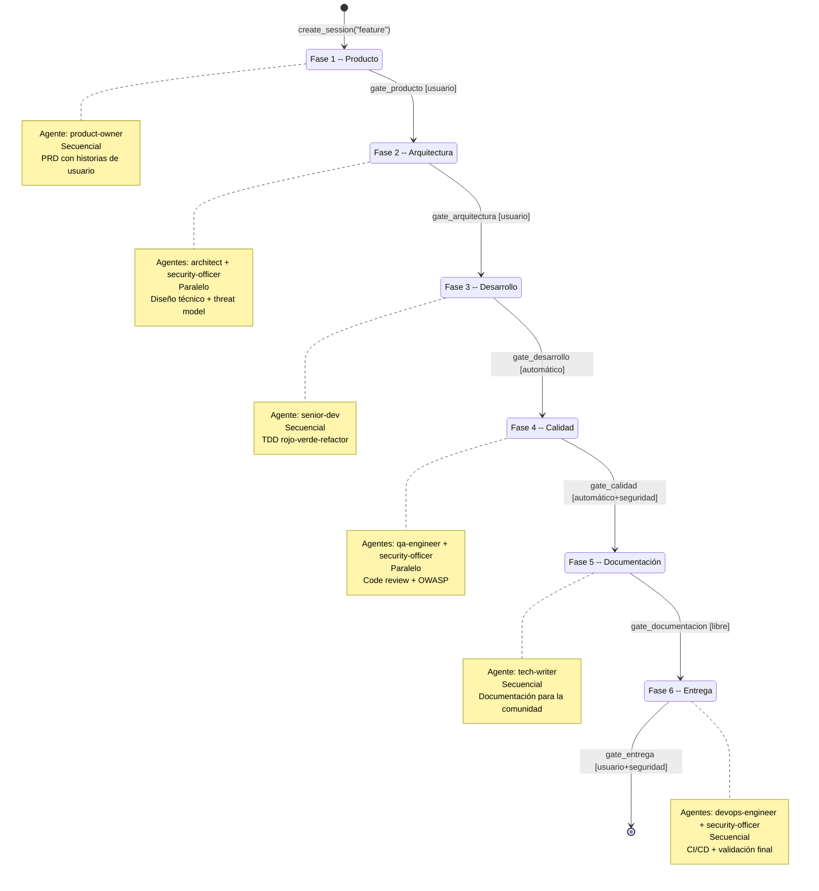
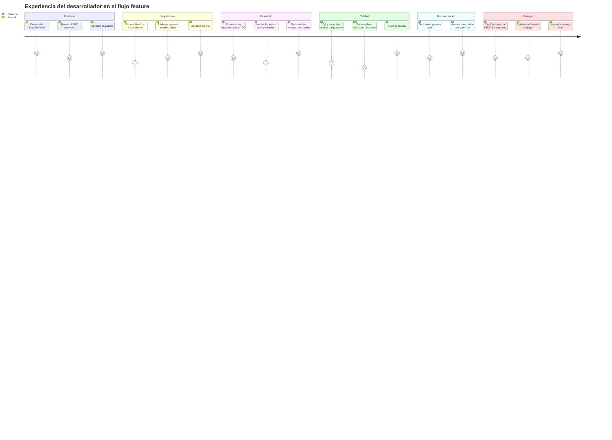
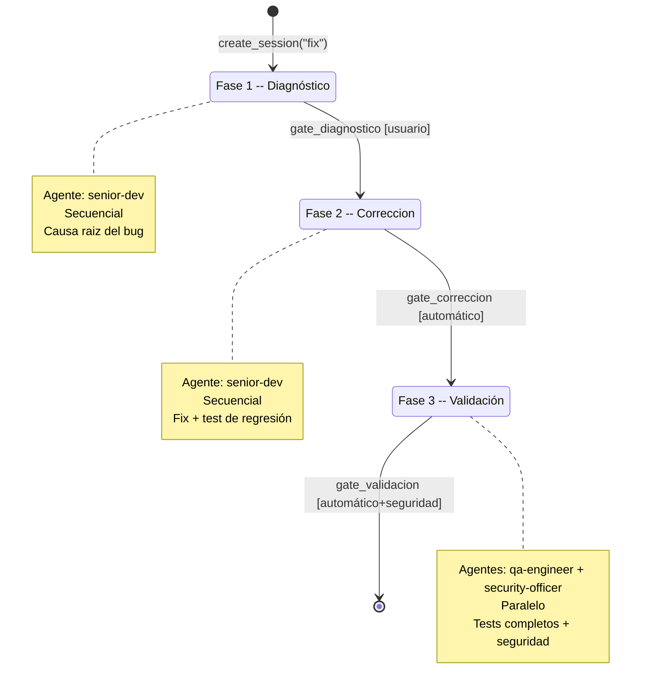
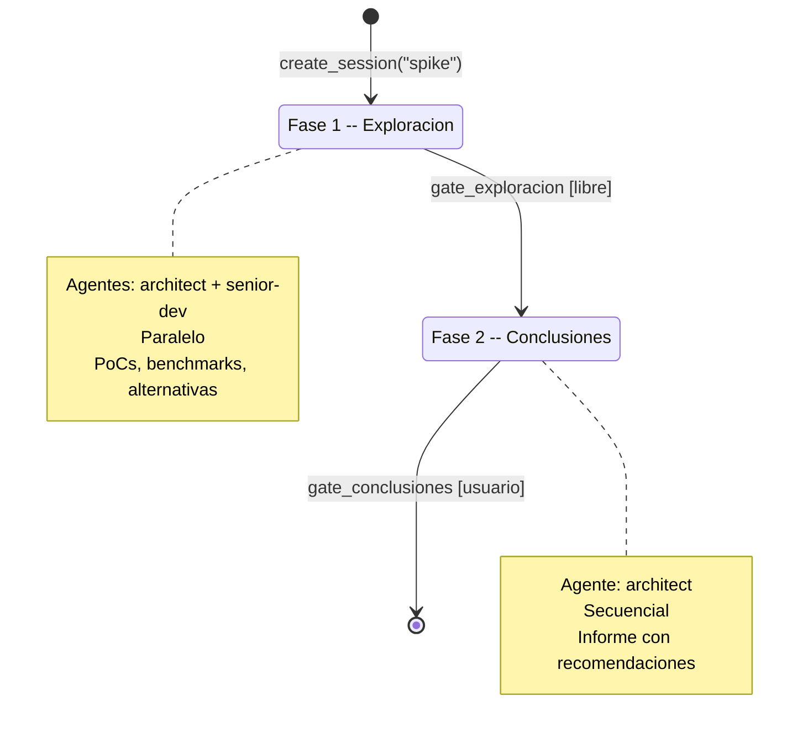
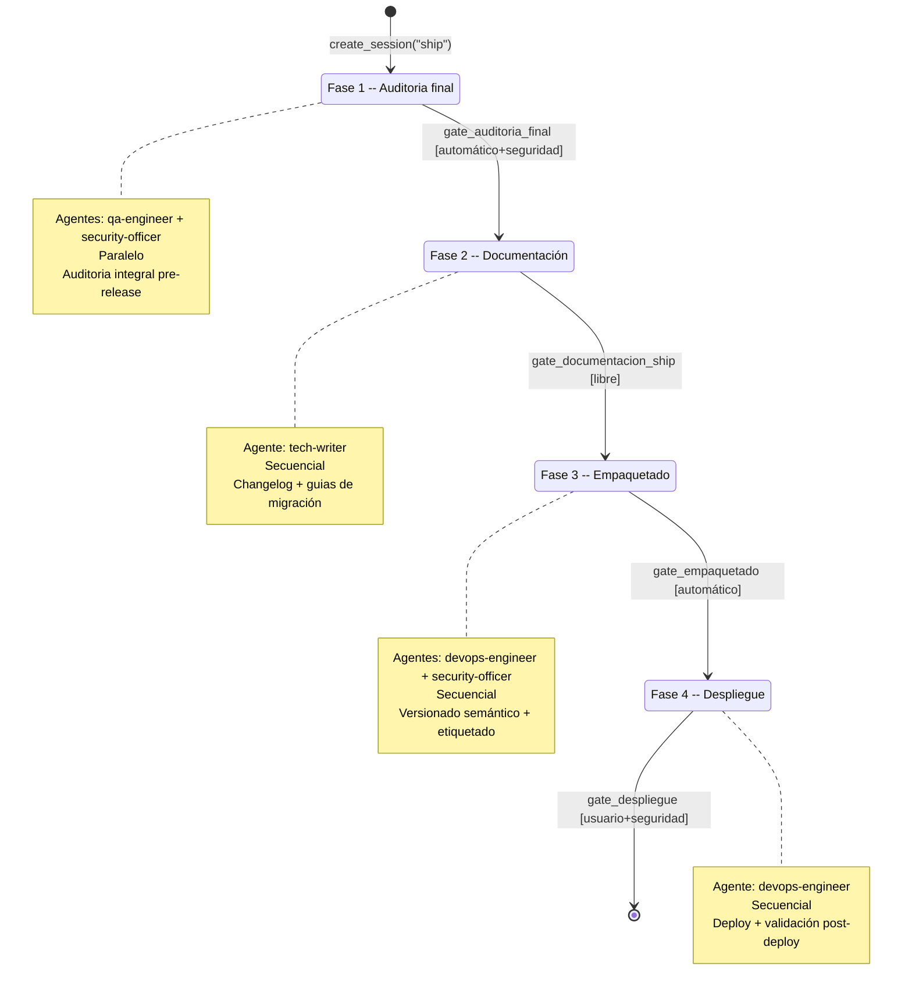
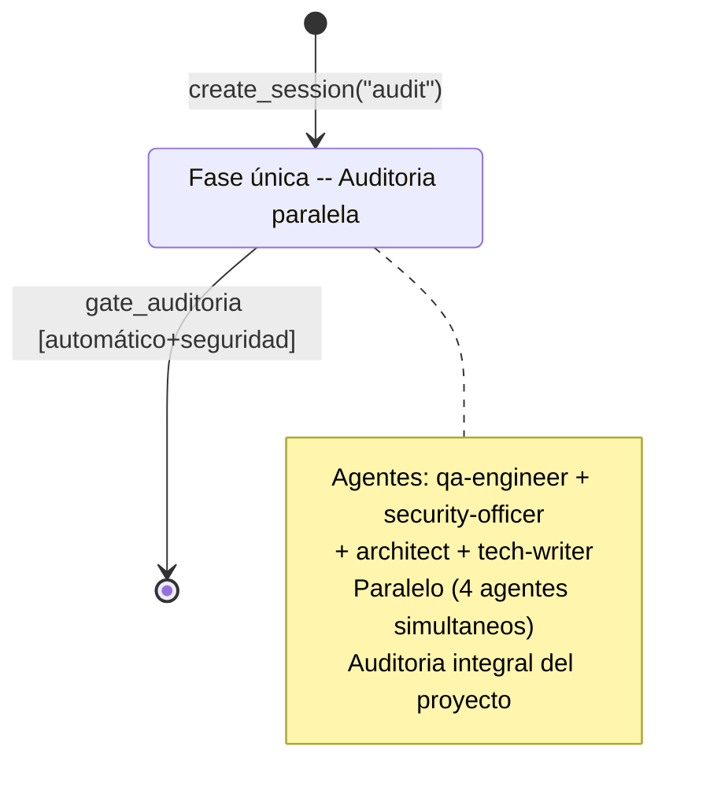

# Flujos de trabajo

Alfred Dev organiza el desarrollo en 5 flujos predefinidos, cada uno compuesto por fases secuenciales con quality gates entre ellas. La razon de esta estructura es que el desarrollo de software no es un proceso monolítico: una funcionalidad nueva requiere análisis de requisitos, diseño, implementacion, revision de calidad, documentación y entrega, mientras que un hotfix solo necesita diagnóstico, correccion y validación. Forzar el mismo flujo para ambos escenarios seria tan ineficiente como no tener flujo alguno.

Cada flujo responde a un escenario real del ciclo de vida del software:

| Flujo | Escenario | Fases |
|-------|-----------|-------|
| `feature` | Nueva funcionalidad, desde la idea hasta la entrega | 6 |
| `fix` | Correccion de un bug, desde el diagnóstico hasta la validación | 3 |
| `spike` | Investigación exploratoria con conclusiones formales | 2 |
| `ship` | Release completa: auditoria, empaquetado y despliegue | 4 |
| `audit` | Auditoria integral del proyecto en un solo paso | 1 |

Los flujos no son arbitrarios: cada uno define exactamente que agentes participan, en que orden se ejecutan y que condiciones deben cumplirse para avanzar de una fase a la siguiente. Esas condiciones son las quality gates, puntos de control que actuan como barreras entre fases para garantizar que el trabajo cumple los estandares antes de progresar.

---

## Los 5 tipos de gate

Las gates son el mecanismo central de control de calidad del orquestador. Sin ellas, las fases serian simplemente una lista de tareas sin garantias de que el resultado de una sea válido antes de empezar la siguiente. El tipo de gate de cada fase no se elige al azar: refleja el nivel de riesgo y la naturaleza de la validación que requiere esa transición concreta.

El orquestador define 5 tipos de gate como constantes en `orchestrator.py`:

```python
GATE_LIBRE = "libre"
GATE_USUARIO = "usuario"
GATE_AUTOMATICO = "automático"
GATE_USUARIO_SEGURIDAD = "usuario+seguridad"
GATE_AUTOMATICO_SEGURIDAD = "automático+seguridad"
```

### Gate `libre`

Se supera siempre que el resultado sea favorable. No requiere ni tests verdes ni auditoria de seguridad. Este tipo de gate existe porque hay fases donde no tiene sentido exigir validaciones técnicas: por ejemplo, la fase de documentación genera prosa y diagramas, no código ejecutable. Pedir tests verdes a un fichero Markdown seria absurdo. La gate libre confiere al flujo la flexibilidad de avanzar rapidamente en fases que producen artefactos no ejecutables, sin relajar el rigor en las fases que si lo necesitan.

### Gate `usuario`

Requiere aprobacion explícita del usuario para superarse. Se usa en fases donde el criterio de aceptacion es subjetivo y no puede automatizarse: aceptar un PRD, aprobar un diseño arquitectonico o dar el visto bueno a las conclusiones de una investigación son decisiones que dependen del contexto del proyecto y de las prioridades del equipo. Ningun test automatizado puede sustituir ese juicio.

### Gate `automático`

Requiere que el resultado sea favorable y que los tests pasen correctamente. Se usa en fases de desarrollo donde los criterios de aceptacion son objetivos y medibles: el código compila, los tests pasan, el linter no reporta errores. La ventaja de este tipo de gate es que no necesita intervencion humana: si las metricas son verdes, el flujo avanza. Esto permite que las fases de implementacion sean mas fluidas sin sacrificar la verificación.

### Gate `usuario+seguridad`

Requiere aprobacion explícita del usuario y además que la auditoria de seguridad sea favorable. Se usa en fases de entrega donde hay riesgo de despliegue: antes de hacer merge o de publicar una release, alguien debe confirmar que el resultado es el esperado y que no hay vulnerabilidades abiertas. La combinación de juicio humano y validación de seguridad existe porque un despliegue con una vulnerabilidad conocida puede tener consecuencias irreversibles.

### Gate `automático+seguridad`

Requiere tests verdes, auditoria de seguridad favorable y resultado positivo. Es el tipo de gate mas estricto del sistema y se usa en fases de calidad y auditoria donde el margen de error debe ser mínimo. La fase de calidad del flujo feature, por ejemplo, combina code review (qa-engineer) con análisis OWASP (security-officer): ambas validaciones deben ser satisfactorias para que el código pase a documentación. No basta con que los tests pasen si hay una inyección SQL pendiente, ni con que la seguridad este limpia si los tests fallan.

### Resumen comparativo

La siguiente tabla muestra de un vistazo que condiciones exige cada tipo de gate. Es util como referencia rápida al leer las definiciones de los flujos:

| Tipo de gate | Resultado favorable | Tests verdes | Seguridad OK | Aprobacion del usuario |
|--------------|:-------------------:|:------------:|:------------:|:----------------------:|
| `libre` | Si | -- | -- | -- |
| `usuario` | Si | -- | -- | Si |
| `automático` | Si | Si | -- | -- |
| `usuario+seguridad` | Si | -- | Si | Si |
| `automático+seguridad` | Si | Si | Si | -- |

---

## Formato de veredicto

Todos los agentes utilizan un formato estandarizado para emitir su veredicto cuando evaluan una gate. Este formato uniforme es importante porque permite al orquestador procesar los resultados de forma mecánica, sin tener que interpretar textos libres. Además, garantiza que tanto el usuario como los hooks puedan leer el veredicto de cualquier agente con la misma lógica.

Los tres posibles resultados son:

| Veredicto | Significado | Efecto sobre la gate |
|-----------|-------------|----------------------|
| **APROBADO** | El trabajo cumple todos los criterios exigidos por la gate. | La gate se supera y el flujo puede avanzar a la siguiente fase. |
| **APROBADO CON CONDICIONES** | El trabajo cumple los criterios minimos, pero hay observaciones que conviene atender. | La gate se supera, pero las observaciones quedan registradas como deuda técnica o mejoras pendientes. |
| **RECHAZADO** | El trabajo no cumple los criterios exigidos. | La gate bloquea el avance. Es necesario corregir los problemas senalados y volver a evaluar. |

La distinción entre APROBADO y APROBADO CON CONDICIONES es deliberada: permite que el flujo no se detenga por observaciones menores (un nombre de variable mejorable, un comentario que podria ser mas claro) mientras deja constancia formal de que hay aspectos a revisar. Esto evita el efecto de «todo o nada» que frustra a los desarrolladores cuando una revision bloquea el avance por cuestiones cosmeticas.

---

## Flujo feature

El flujo feature es el mas completo del sistema: 6 fases con 7 agentes involucrados y 5 tipos de gate distintos. Existe para cubrir el ciclo de vida completo de una funcionalidad nueva, desde la definición de requisitos hasta la entrega final. Cada fase aporta un tipo de validación diferente y los agentes se eligen por su especialización, no por rotación.

### Fase 1: producto

La primera fase del flujo existe porque escribir código sin entender que problema se resuelve es la forma mas cara de perder el tiempo. El agente `product-owner` analiza la peticion del usuario, identifica requisitos funcionales y no funcionales, y genera un PRD (Product Requirements Document) con historias de usuario.

La gate es de tipo `usuario` porque solo el usuario puede decidir si el PRD refleja lo que realmente necesita. Ningun test automatizado puede validar que los requisitos sean los correctos.

| Propiedad | Valor |
|-----------|-------|
| Agentes | `product-owner` |
| Ejecución | Secuencial |
| Gate | `gate_producto` |
| Tipo de gate | `usuario` |
| Artefacto | PRD con historias de usuario |

### Fase 2: arquitectura

Una vez aprobados los requisitos, hay que decidir como implementarlos. Esta fase involucra dos agentes en paralelo: `architect` disena la arquitectura técnica (patrones, componentes, interfaces) mientras `security-officer` elabora el threat model (superficie de ataque, vectores, mitigaciones). Trabajan en paralelo porque sus tareas son independientes: el architect no necesita el threat model para disenar la arquitectura, y el security-officer no necesita la propuesta arquitectonica para identificar amenazas. Al terminar, ambos artefactos se presentan juntos al usuario.

La gate es de tipo `usuario` porque la arquitectura es una decisión estrategica que afecta a todo el proyecto. El usuario debe entender y aceptar tanto el diseño como los riesgos identificados antes de que se escriba una sola linea de código.

| Propiedad | Valor |
|-----------|-------|
| Agentes | `architect`, `security-officer` |
| Ejecución | Paralelo |
| Gate | `gate_arquitectura` |
| Tipo de gate | `usuario` |
| Artefactos | Propuesta arquitectonica, threat model |

### Fase 3: desarrollo

Con los requisitos aprobados y la arquitectura validada, el agente `senior-dev` implementa el código siguiendo TDD estricto: primero escribe los tests que fallan (rojo), luego el código mínimo para que pasen (verde) y finalmente refactoriza para mejorar la calidad sin cambiar el comportamiento (refactor). Este ciclo garantiza que cada linea de código tiene al menos un test que la respalda.

La gate es de tipo `automático` porque en esta fase los criterios de aceptacion son objetivos: el código compila y los tests pasan. No se necesita aprobacion humana para verificar que `2 + 2 == 4`. Esto permite que el desarrollador itere rapidamente sin esperar validaciones externas.

| Propiedad | Valor |
|-----------|-------|
| Agentes | `senior-dev` |
| Ejecución | Secuencial |
| Gate | `gate_desarrollo` |
| Tipo de gate | `automático` |
| Artefacto | Código con tests |

### Fase 4: calidad

La fase de calidad es la barrera mas rigurosa del flujo. Dos agentes trabajan en paralelo: `qa-engineer` ejecuta code review, plan de tests y análisis de cobertura, mientras `security-officer` realiza auditorias OWASP, revisa dependencias y genera el SBOM. El paralelismo se justifica porque ambas auditorias son independientes y juntas cubren las dos dimensiones críticas de la calidad: funcional (funciona correctamente?) y no funcional (es seguro?).

La gate es de tipo `automático+seguridad`, la mas estricta del sistema. Esto significa que para avanzar se necesitan tres cosas simultaneamente: tests verdes, auditoria de seguridad favorable y resultado positivo del code review. Si alguna de las tres falla, la gate bloquea el avance y hay que corregir antes de continuar.

| Propiedad | Valor |
|-----------|-------|
| Agentes | `qa-engineer`, `security-officer` |
| Ejecución | Paralelo |
| Gate | `gate_calidad` |
| Tipo de gate | `automático+seguridad` |
| Artefactos | Informe QA, informe de seguridad |

### Fase 5: documentación

El agente `tech-writer` genera la documentación técnica y de usuario pensada para la comunidad: documentación de API, guias de uso, diagramas de arquitectura y cualquier otro artefacto necesario para que otros desarrolladores entiendan la funcionalidad sin leer el código fuente.

La gate es de tipo `libre` porque la documentación es texto, no código ejecutable. No tiene sentido exigir tests verdes a un fichero Markdown. Basta con que el resultado sea favorable (el tech-writer ha generado la documentación) para avanzar a la última fase.

| Propiedad | Valor |
|-----------|-------|
| Agentes | `tech-writer` |
| Ejecución | Secuencial |
| Gate | `gate_documentacion` |
| Tipo de gate | `libre` |
| Artefacto | Documentación técnica y de usuario |

### Fase 6: entrega

La fase final prepara el entregable: `devops-engineer` se encarga del CI/CD, el changelog y la preparacion del merge, mientras `security-officer` realiza una validación final para asegurar que nada ha cambiado desde la fase de calidad que comprometa la seguridad.

La gate es de tipo `usuario+seguridad` porque un merge o deploy incorrecto puede afectar a todo el equipo. Se exige tanto la aprobacion explícita del usuario (que confirme que quiere entregar) como el visto bueno de seguridad (que confirme que no hay vulnerabilidades abiertas). Es la última linea de defensa antes de que el código llegue a produccion.

| Propiedad | Valor |
|-----------|-------|
| Agentes | `devops-engineer`, `security-officer` |
| Ejecución | Secuencial |
| Gate | `gate_entrega` |
| Tipo de gate | `usuario+seguridad` |
| Artefactos | Changelog, artefacto de entrega |

### Diagrama de estados del flujo feature

El siguiente diagrama muestra las 6 fases como estados y las gates como transiciones entre ellos. Las notas indican que agentes participan en cada fase y como se ejecutan.



### Experiencia del usuario en el flujo feature

Este diagrama de recorrido muestra como percibe el usuario las distintas fases del flujo, que actividades realiza en cada una y que nivel de satisfaccion cabe esperar. Las fases iniciales requieren mas participacion activa (revisar PRD, aprobar arquitectura), las intermedias son mas autonomas (el senior-dev implementa, QA revisa) y la final vuelve a requerir atencion para aprobar la entrega.



---

## Flujo fix

El flujo fix es mas corto que el feature porque un bug ya tiene contexto: hay código existente que no funciona como deberia. No hace falta análisis de requisitos ni diseño arquitectonico; hace falta encontrar la causa raiz, corregirla y validar que la correccion no rompe nada.

### Fase 1: diagnóstico

El agente `senior-dev` investiga la causa raiz del bug: reproduce el problema, analiza logs y trazas, identifica el componente afectado y documenta sus hallazgos. La gate es de tipo `usuario` porque el diagnóstico puede revelar que el problema es mas profundo de lo esperado (por ejemplo, un defecto de diseño), y el usuario debe decidir si proceder con un fix puntual o replantear la solucion.

| Propiedad | Valor |
|-----------|-------|
| Agentes | `senior-dev` |
| Ejecución | Secuencial |
| Gate | `gate_diagnostico` |
| Tipo de gate | `usuario` |
| Artefacto | Informe de causa raiz |

### Fase 2: correccion

Con el diagnóstico aprobado, `senior-dev` implementa la correccion junto con un test de regresión que demuestra que el bug queda resuelto. El test de regresión es obligatorio: sin el, no hay forma de verificar automáticamente que el bug no vuelva a aparecer en el futuro. La gate es de tipo `automático` porque el criterio de aceptacion es objetivo: el test de regresión pasa y los tests existentes siguen verdes.

| Propiedad | Valor |
|-----------|-------|
| Agentes | `senior-dev` |
| Ejecución | Secuencial |
| Gate | `gate_correccion` |
| Tipo de gate | `automático` |
| Artefacto | Fix con test de regresión |

### Fase 3: validación

La fase final ejecuta la suite completa de tests y una revision de seguridad para asegurar que la correccion no ha introducido efectos colaterales. `qa-engineer` y `security-officer` trabajan en paralelo porque sus revisiones son independientes. La gate es de tipo `automático+seguridad`, la mas estricta, porque un fix mal validado puede causar mas dano que el bug original.

| Propiedad | Valor |
|-----------|-------|
| Agentes | `qa-engineer`, `security-officer` |
| Ejecución | Paralelo |
| Gate | `gate_validacion` |
| Tipo de gate | `automático+seguridad` |
| Artefacto | Informe de validación completa |

### Diagrama de estados del flujo fix



---

## Flujo spike

El flujo spike existe para investigaciones exploratorias donde el objetivo no es producir código de produccion, sino responder una pregunta técnica: es viable esta tecnología para nuestro caso de uso? Que alternativas hay? Cual es el rendimiento esperado? La estructura es intencionadamente ligera (2 fases) porque una investigación con demasiada burocracia deja de ser exploratoria.

### Fase 1: exploracion

`architect` y `senior-dev` trabajan en paralelo para cubrir dos angulos complementarios: el architect evalua alternativas a nivel de diseño (patrones, integraciones, trade-offs) mientras el senior-dev construye pruebas de concepto y ejecuta benchmarks. El paralelismo tiene sentido porque ambas perspectivas son independientes y juntas proporcionan una vision mas completa.

La gate es de tipo `libre` porque la exploracion es por definición abierta: no hay tests que pasar ni código de produccion que auditar. Basta con que los agentes produzcan resultados para avanzar. Esto es deliberado: bloquear una investigación con gates estrictas mataria la creatividad y la velocidad que se espera de un spike.

| Propiedad | Valor |
|-----------|-------|
| Agentes | `architect`, `senior-dev` |
| Ejecución | Paralelo |
| Gate | `gate_exploracion` |
| Tipo de gate | `libre` |
| Artefactos | PoCs, benchmarks, análisis de alternativas |

### Fase 2: conclusiones

El agente `architect` consolida todos los hallazgos de la exploracion en un informe formal con recomendaciones accionables. El informe responde a la pregunta original del spike con datos, no con opiniones. La gate es de tipo `usuario` porque las conclusiones de una investigación afectan a decisiones estrategicas del proyecto y el usuario debe evaluarlas antes de actuar sobre ellas.

| Propiedad | Valor |
|-----------|-------|
| Agentes | `architect` |
| Ejecución | Secuencial |
| Gate | `gate_conclusiones` |
| Tipo de gate | `usuario` |
| Artefacto | Informe con recomendaciones |

### Diagrama de estados del flujo spike



---

## Flujo ship

El flujo ship cubre el proceso completo de release: desde la auditoria previa hasta el despliegue a produccion. Es el flujo con mayor densidad de validaciones de seguridad porque cada fase manipula artefactos que acabaran en manos de usuarios finales. Un error aquí no se corrige con un hotfix rápido: puede requerir un rollback, una comunicación de incidencia o una nueva release.

### Fase 1: auditoria final

Antes de empaquetar nada, `qa-engineer` y `security-officer` auditan el estado actual del proyecto en paralelo. Esta fase existe porque el código puede haber pasado las gates del flujo feature individualmente, pero el conjunto (multiples features, fixes y refactors acumulados) necesita una validación integral. La gate es de tipo `automático+seguridad` porque los criterios son objetivos y no admiten excepciones antes de una release.

| Propiedad | Valor |
|-----------|-------|
| Agentes | `qa-engineer`, `security-officer` |
| Ejecución | Paralelo |
| Gate | `gate_auditoria_final` |
| Tipo de gate | `automático+seguridad` |
| Artefacto | Informe de auditoria integral |

### Fase 2: documentación

El agente `tech-writer` actualiza la documentación de release: changelog, guias de migración, notas de versión y cualquier otro documento que los usuarios necesiten para adoptar la nueva versión. La gate es de tipo `libre` porque no hay código que validar, solo prosa.

| Propiedad | Valor |
|-----------|-------|
| Agentes | `tech-writer` |
| Ejecución | Secuencial |
| Gate | `gate_documentacion_ship` |
| Tipo de gate | `libre` |
| Artefactos | Changelog, notas de versión, guias de migración |

### Fase 3: empaquetado

`devops-engineer` y `security-officer` generan el artefacto de release con versionado semántico, etiquetado y firma. La participacion del security-officer en esta fase asegura que el artefacto empaquetado no incluye dependencias vulnerables ni secretos filtrados. La gate es de tipo `automático` porque la validación del empaquetado es mecánica: el artefacto se genera, los checksums coinciden, la firma es valida.

| Propiedad | Valor |
|-----------|-------|
| Agentes | `devops-engineer`, `security-officer` |
| Ejecución | Secuencial |
| Gate | `gate_empaquetado` |
| Tipo de gate | `automático` |
| Artefacto | Release con versionado semántico |

### Fase 4: despliegue

El agente `devops-engineer` ejecuta el despliegue a produccion con validación post-deploy y rollback preparado. La gate es de tipo `usuario+seguridad` porque el despliegue es el punto de no retorno: una vez publicado, los usuarios pueden descargarlo. Se exige aprobacion explícita del usuario (que confirme que quiere desplegar) y seguridad OK (que confirme que todo esta limpio).

| Propiedad | Valor |
|-----------|-------|
| Agentes | `devops-engineer` |
| Ejecución | Secuencial |
| Gate | `gate_despliegue` |
| Tipo de gate | `usuario+seguridad` |
| Artefacto | Release desplegada |

### Diagrama de estados del flujo ship



---

## Flujo audit

El flujo audit es el único que tiene una sola fase, y eso es una decisión de diseño consciente. Su propósito es ejecutar una auditoria integral del proyecto lo mas rápido posible, sin la ceremonia de un flujo multifase. Se usa de dos formas: como flujo independiente (cuando el usuario quiere un chequeo rápido del estado del proyecto) y como paso obligatorio al cierre de sprint.

### Fase 1: auditoria paralela

Cuatro agentes trabajan simultaneamente, cada uno en su ámbito de especialización:

- `qa-engineer` ejecuta la suite de tests, revisa cobertura y analiza deuda técnica.
- `security-officer` audita dependencias, busca vulnerabilidades y verifica que no haya secretos expuestos.
- `architect` revisa la coherencia arquitectonica, detecta violaciones de patrones y evalua la deuda de diseño.
- `tech-writer` verifica la completitud y coherencia de la documentación existente.

El paralelismo total se justifica porque los cuatro agentes trabajan sobre aspectos completamente independientes del proyecto. No hay dependencia entre la revision de cobertura de tests y la auditoria de dependencias, ni entre la coherencia arquitectonica y la documentación. Ejecutarlos en serie cuadruplicaria el tiempo sin ningun beneficio.

La gate es de tipo `automático+seguridad` porque una auditoria que se pueda superar con resultados mediocres no tiene sentido. Si alguno de los cuatro agentes detecta un problema crítico, la gate bloquea y hay que resolverlo.

| Propiedad | Valor |
|-----------|-------|
| Agentes | `qa-engineer`, `security-officer`, `architect`, `tech-writer` |
| Ejecución | Paralelo |
| Gate | `gate_auditoria` |
| Tipo de gate | `automático+seguridad` |
| Artefactos | Informes de calidad, seguridad, arquitectura y documentación |

### Diagrama de estados del flujo audit



---

## El patron de paralelismo

No todas las fases ejecutan agentes en paralelo, y la decisión de cuando usar paralelismo no es arbitraria. El criterio es simple: se ejecutan en paralelo cuando los agentes trabajan de forma independiente y sus resultados no dependen unos de otros. Se ejecutan en secuencia cuando hay dependencia entre ellos.

### Fases con ejecución paralela

| Flujo | Fase | Agentes en paralelo | Razon del paralelismo |
|-------|------|---------------------|-----------------------|
| `feature` | arquitectura | `architect`, `security-officer` | El diseño técnico y el threat model son independientes. El architect no necesita el threat model para disenar, ni el security-officer la arquitectura para identificar amenazas. |
| `feature` | calidad | `qa-engineer`, `security-officer` | El code review funcional y la auditoria de seguridad cubren dimensiones distintas del mismo código. No hay dependencia entre ellos. |
| `fix` | validación | `qa-engineer`, `security-officer` | La suite de tests y la revision de seguridad son independientes. Ejecutarlas en paralelo reduce el tiempo de validación a la mitad. |
| `spike` | exploracion | `architect`, `senior-dev` | El architect evalua alternativas de diseño mientras el senior-dev construye PoCs. Ambos enfoques se complementan sin depender uno del otro. |
| `ship` | auditoria_final | `qa-engineer`, `security-officer` | Auditoria funcional y de seguridad, independientes como en la fase de calidad del flujo feature. |
| `audit` | auditoria_paralela | `qa-engineer`, `security-officer`, `architect`, `tech-writer` | Las cuatro dimensiones (calidad, seguridad, arquitectura, documentación) son completamente independientes. Máximo paralelismo posible. |

### Fases sin paralelismo

Las fases restantes usan ejecución secuencial por una de estas dos razones:

1. **Un solo agente**: cuando solo hay un agente (como `senior-dev` en la fase de desarrollo o `tech-writer` en documentación), el paralelismo no aplica.
2. **Dependencia implícita**: en la fase de entrega del flujo feature, `devops-engineer` y `security-officer` aparecen juntos pero no en paralelo porque el security-officer necesita validar el artefacto que genera el devops-engineer, no un aspecto independiente del proyecto.

---

## Estado de sesión

Todo el estado del flujo en curso se persiste en un único fichero JSON: `.claude/alfred-dev-state.json`. Este fichero es el eje de coordinación de todo el sistema: los commands lo leen para saber en que fase estamos y que agentes invocar, los hooks lo leen para decidir si bloquear una accion o dejarla pasar, y el orquestador lo escribe con escritura atomica (escritura en fichero temporal + renombrado con `os.replace`) para evitar corrupcion si el proceso se interrumpe.

La decisión de usar un fichero JSON plano en lugar de la base de datos SQLite es deliberada: el estado de la sesión es efimero (dura lo que dura el flujo) y su estructura es plana (no hay relaciones entre entidades). La base de datos se reserva para la memoria histórica del proyecto, que si tiene relaciones y necesita consultas complejas.

### Estructura del JSON

```json
{
  "comando": "feature",
  "descripción": "Implementar sistema de notificaciones push",
  "fase_actual": "desarrollo",
  "fase_numero": 2,
  "fases_completadas": [
    {
      "nombre": "producto",
      "resultado": "aprobado",
      "artefactos": ["prd-notificaciones.md"],
      "completada_en": "2026-02-21T10:15:30+00:00"
    },
    {
      "nombre": "arquitectura",
      "resultado": "aprobado",
      "artefactos": ["diseño-notificaciones.md", "threat-model.md"],
      "completada_en": "2026-02-21T11:42:18+00:00"
    }
  ],
  "artefactos": [
    "prd-notificaciones.md",
    "diseño-notificaciones.md",
    "threat-model.md"
  ],
  "creado_en": "2026-02-21T09:30:00+00:00",
  "actualizado_en": "2026-02-21T11:42:18+00:00"
}
```

### Descripción de los campos

| Campo | Tipo | Descripción |
|-------|------|-------------|
| `comando` | `string` | Identificador del flujo activo (`feature`, `fix`, `spike`, `ship`, `audit`). |
| `descripción` | `string` | Descripción en lenguaje natural de la tarea, tal como la proporciono el usuario. |
| `fase_actual` | `string` | Nombre de la fase en curso, o `"completado"` si el flujo ha terminado. |
| `fase_numero` | `int` | Índice de la fase actual (base 0). Permite al orquestador acceder directamente a la definición de la fase en el array `FLOWS[comando]["fases"]`. |
| `fases_completadas` | `array` | Registro histórico de las fases superadas, cada una con su nombre, resultado, artefactos generados y marca temporal de finalizacion. |
| `artefactos` | `array` | Lista acumulada de todos los artefactos generados a lo largo del flujo. Es la union de los artefactos de cada fase completada. |
| `creado_en` | `string` | Marca temporal ISO 8601 del momento en que se creo la sesión. |
| `actualizado_en` | `string` | Marca temporal ISO 8601 de la última modificacion del estado. Se actualiza cada vez que el orquestador avanza de fase. |

### Como leen los hooks este fichero

Los hooks acceden al fichero de estado para tomar decisiones contextuales. Por ejemplo, el hook `quality-gate.py` necesita saber si estamos en una fase de desarrollo (donde los tests rojos son informativos) o en una fase de calidad (donde los tests rojos bloquean el avance). El hook `activity-capture.py` necesita saber en que fase y flujo estamos para asociar los eventos capturados a la iteracion correcta en la memoria persistente.

El patron de lectura es siempre el mismo: el hook lee el fichero JSON, extrae los campos que necesita (`comando`, `fase_actual`, `fase_numero`) y adapta su comportamiento en función del contexto. Si el fichero no existe (porque no hay ningun flujo activo), el hook funciona en modo por defecto sin bloquear nada.
