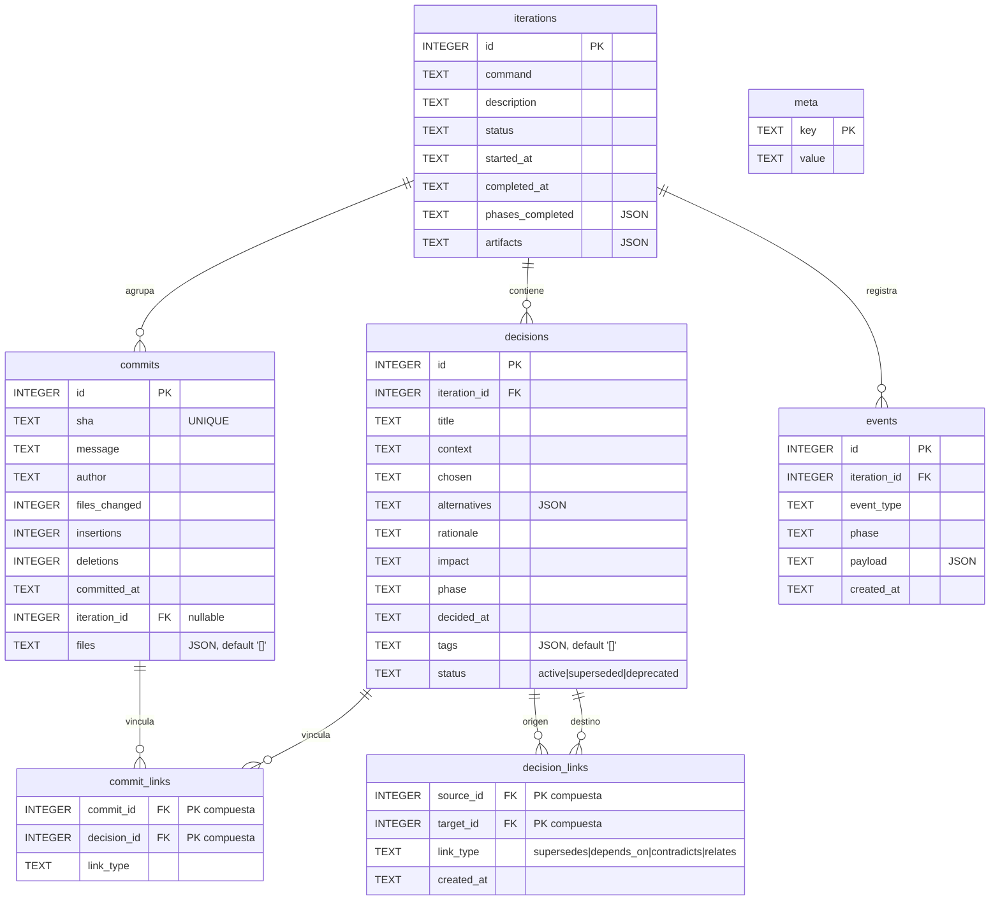
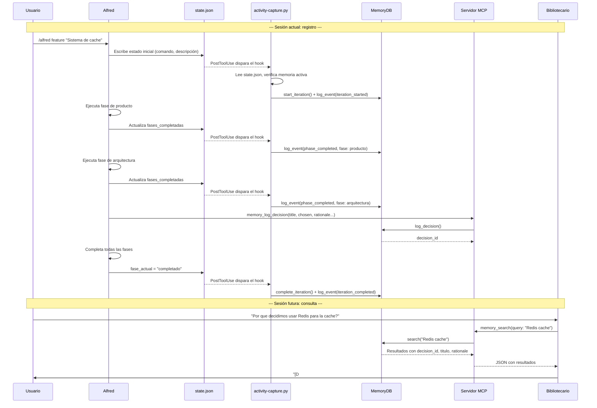

# Memoria persistente

Las conversaciones de Claude Code son efímeras por naturaleza: cuando una sesión termina, todo el contexto acumulado --decisiones de diseño, razones para descartar alternativas, compromisos entre rendimiento y mantenibilidad, el hilo de razonamiento que llevo a elegir una arquitectura concreta-- desaparece sin dejar rastro. Esto significa que cada vez que el desarrollador abre una sesión nueva, Alfred parte de cero. Si hace tres semanas se decidio usar SQLite en lugar de PostgreSQL tras un análisis detallado de las restricciones del proyecto, Alfred no lo sabe; si se descarto una aproximacion con Redis porque el despliegue no podia depender de servicios externos, Alfred tampoco lo recuerda.

La memoria persistente resuelve este problema almacenando decisiones, iteraciones, commits y eventos del flujo de trabajo en una base de datos SQLite local. Cada proyecto tiene su propia base de datos en `.claude/almundo-memory.db`, aislada del resto. Gracias a esta capa, Almundo IA puede responder preguntas como "por que decidimos no usar un ORM" o "que se implemento en la iteracion 3" con evidencia verificable, no con inferencias. La trazabilidad que proporciona es completa: desde el problema que se resolvia hasta el commit que lo implemento, pasando por las alternativas que se descartaron y la justificacion de cada eleccion.

La memoria es una **capa lateral opcional**. Si no se activa, el flujo del plugin sigue funcionando exactamente igual que siempre. No hay penalización por no usarla; simplemente, las sesiones futuras no tendran acceso al histórico.


## Esquema de la base de datos

El esquema esta disenado para capturar cuatro tipos de información que se complementan entre si. Las **iteraciones** representan ciclos completos de trabajo (un feature, un fix, un spike); las **decisiones** capturan el razonamiento formal detrás de cada eleccion; los **commits** vinculan las decisiones con el código real; y los **eventos** registran la cronología mecánica del flujo (fases completadas, gates superadas).

La relación entre estas tablas permite reconstruir la historia completa de un cambio: desde la iteracion que lo inicio, pasando por las decisiones que lo fundamentaron, hasta los commits que lo materializaron. La tabla intermedia `commit_links` establece la trazabilidad muchos-a-muchos entre commits y decisiones, porque un commit puede implementar varias decisiones y una decisión puede requerir varios commits.



### Detalle de cada tabla

**iterations** almacena los ciclos de trabajo. El campo `command` indica el tipo de flujo (`feature`, `fix`, `spike`, `ship`, `audit`). El campo `status` evoluciona de `active` a `completed` o `abandoned`. Los campos `phases_completed` y `artifacts` son JSON opcionales que enriquecen el registro.

**decisions** captura el razonamiento formal. Cada decisión tiene un `title` corto, el `context` del problema, la opcion `chosen`, las `alternatives` descartadas (almacenadas como array JSON), la `rationale` que justifica la eleccion, el `impact` (low, medium, high, critical) y la `phase` del flujo en la que se tomo. Si no se proporciona `iteration_id`, se vincula automáticamente a la iteracion activa. Desde la v2 del esquema, cada decisión incorpora `tags` (array JSON de etiquetas libres, por defecto vacio) y `status` (`active`, `superseded` o `deprecated`, por defecto `active`) para gestionar su ciclo de vida sin duplicar registros.

**commits** registra metadatos de los commits de Git. El campo `sha` es único para garantizar idempotencia: si se intenta registrar un commit que ya existe, la operación se ignora silenciosamente. Esto permite que la captura automática invoque `log_commit()` sin preocuparse de duplicados. Desde la v2, el campo `files` (array JSON de rutas) almacena los ficheros afectados por el commit, facilitando busquedas por fichero y trazabilidad de cambios.

**commit_links** establece vinculos entre commits y decisiones. El campo `link_type` indica el tipo de relación: `implements` (el commit implementa la decisión), `reverts` (lo deshace) o `relates` (relación genérica). La clave primaria compuesta `(commit_id, decision_id)` impide duplicados.

**decision_links** (v2) establece relaciones entre pares de decisiones. El campo `link_type` admite cuatro valores: `supersedes` (la decisión origen reemplaza a la destino), `depends_on` (depende de ella), `contradicts` (entra en conflicto) y `relates` (relación genérica). La clave primaria compuesta `(source_id, target_id)` impide duplicados. Las consultas son bidireccionales: `get_decision_links(id)` devuelve tanto los enlaces donde la decisión es origen como aquellos donde es destino.

**events** captura hechos mecanicos del flujo: fases completadas, gates superadas, aprobaciones. El campo `payload` es un JSON libre que almacena datos adicionales. Los eventos proporcionan la cronología detallada que las decisiones no cubren.

**meta** almacena pares clave-valor de metadatos internos: versión del esquema (`schema_version`), fecha de creación (`created_at`), estado de FTS5 (`fts_enabled`).

### Índices

El esquema incluye cinco índices para acelerar las consultas mas frecuentes:

| Índice | Tabla | Columna | Propósito |
|--------|-------|---------|-----------|
| `idx_iterations_status` | iterations | status | Filtrar iteraciones activas rapidamente |
| `idx_decisions_iteration` | decisions | iteration_id | Obtener decisiones de una iteracion |
| `idx_commits_iteration` | commits | iteration_id | Obtener commits de una iteracion |
| `idx_events_iteration` | events | iteration_id | Obtener eventos de una iteracion |
| `idx_events_type` | events | event_type | Filtrar eventos por tipo |
| `idx_decision_links_target` | decision_links | target_id | Busqueda bidireccional de relaciones entre decisiones |


## FTS5 (busqueda de texto completo)

FTS5 es una extensión de SQLite que proporciona busqueda de texto completo de alto rendimiento. En el contexto de la memoria de Alfred Dev, permite buscar por terminos en el contenido de decisiones y commits sin necesidad de operadores `LIKE %termino%`, que son lentos porque requieren un recorrido completo de la tabla.

La razon de usar FTS5 en lugar de depender exclusivamente de `LIKE` es el rendimiento a escala. Un proyecto con cientos de decisiones y miles de commits necesita busquedas rapidas para que el agente Bibliotecario pueda responder consultas historicas sin latencia perceptible. FTS5 crea un índice invertido que permite busquedas en tiempo constante independientemente del tamaño de la tabla.

### Tabla virtual `memory_fts`

Cuando FTS5 esta disponible, `MemoryDB` crea la tabla virtual `memory_fts` con tres columnas:

| Columna | Tipo | Contenido |
|---------|------|-----------|
| `source_type` | TEXT | Tipo de registro: `decisión` o `commit` |
| `source_id` | TEXT | ID del registro original (cast a texto) |
| `content` | TEXT | Texto indexado (concatenacion de campos relevantes) |

Para las decisiones, el campo `content` concatena `title`, `context`, `chosen`, `rationale` y `alternatives` (desde v2). Para los commits, contiene unicamente el `message`.

### Triggers de sincronizacion

El índice FTS5 se mantiene sincronizado con las tablas origen mediante dos triggers `AFTER INSERT`:

- **`fts_insert_decision`**: se dispara al insertar una nueva decisión. Concatena los campos de texto con `COALESCE` para manejar valores nulos y los inserta en `memory_fts`.
- **`fts_insert_commit`**: se dispara al insertar un nuevo commit. Inserta el mensaje del commit en `memory_fts`.

Los triggers garantizan que el índice FTS5 refleja siempre el estado actual de las tablas sin que el código de aplicación tenga que preocuparse de mantener la coherencia.

### Detección en runtime y fallback a LIKE

No todos los entornos SQLite incluyen la extensión FTS5. La detección se realiza en el método `_detect_fts5()` de `MemoryDB`, que intenta crear una tabla FTS5 temporal (`_fts5_test`). Si la operación tiene exito, FTS5 esta disponible y se crea la tabla real con sus triggers. Si lanza un `OperationalError`, se marca `_fts_enabled = False` y todas las busquedas utilizan `LIKE %termino%` como fallback.

El resultado de la detección se persiste en la tabla `meta` con la clave `fts_enabled` (`"1"` o `"0"`) para que otros componentes --como el servidor MCP-- puedan consultarlo sin repetir la prueba.

El método `search()` de `MemoryDB` comprueba el flag `_fts_enabled` y delega automáticamente en `_search_fts()` o `_search_like()`. Desde el punto de vista del consumidor, la interfaz es identica en ambos casos; solo cambia la velocidad.


## Sanitizacion de secretos

La base de datos de memoria podria acabar almacenando secretos si un agente menciona una clave API en una decisión o si un mensaje de commit contiene credenciales por error. Para evitar esta fuga, todo texto que entra en la base de datos pasa por `sanitize_content()`, que aplica 13 patrones regex y reemplaza cada coincidencia por un marcador `[REDACTED:<tipo>]`.

La razon de sanitizar en la capa de persistencia (no en la de presentacion) es que el dano de un secreto almacenado es permanente: una vez que la clave esta en la DB, cualquier consulta futura la expondria. Sanitizar antes de escribir garantiza que la información sensible nunca llega al disco.

Los patrones son los mismos que utiliza el hook `secret-guard.sh` para mantener coherencia en toda la cadena de seguridad del plugin. El orden importa: los patrones mas específicos van primero para evitar que uno genérico consuma un match que deberia ser mas preciso.

### Patrones detectados

| # | Etiqueta | Que detecta | Patron resumido |
|---|----------|-------------|-----------------|
| 1 | `AWS_KEY` | Claves de acceso de AWS | `AKIA` seguido de 16 caracteres alfanumericos |
| 2 | `ANTHROPIC_KEY` | Claves API de Anthropic | Prefijo `sk-ant-` seguido de 20+ caracteres |
| 3 | `SK_KEY` | Claves con prefijo sk- genérico (OpenAI, etc.) | Prefijo `sk-` seguido de 20+ caracteres alfanumericos |
| 4 | `GITHUB_TOKEN` | Tokens personales y PAT de GitHub | Prefijos `ghp_` (36 chars) o `github_pat_` (20+ chars) |
| 5 | `SLACK_TOKEN` | Tokens de Slack (bot, app, user) | Prefijo `xox[bpsa]-` seguido de 10+ caracteres |
| 6 | `GOOGLE_KEY` | Claves API de Google | Prefijo `AIza` seguido de 35 caracteres |
| 7 | `SENDGRID_KEY` | Claves API de SendGrid | Prefijo `SG.` con dos segmentos de 22+ caracteres |
| 8 | `PRIVATE_KEY` | Claves privadas (RSA, EC, DSA, OPENSSH) | Cabecera `-----BEGIN [...] PRIVATE KEY-----` |
| 9 | `JWT` | Tokens JWT codificados en Base64 | Tres segmentos Base64URL separados por puntos |
| 10 | `CONNECTION_STRING` | Cadenas de conexión a base de datos | Protocolo (mysql, postgresql, mongodb, redis, amqp) seguido de credenciales |
| 11 | `SLACK_WEBHOOK` | Webhooks de Slack | URL `hooks.slack.com/services/...` |
| 12 | `DISCORD_WEBHOOK` | Webhooks de Discord | URL `discord.com/api/webhooks/...` |
| 13 | `HARDCODED_CREDENTIAL` | Credenciales hardcodeadas en código | Asignaciones directas como `api_key = "valor"` |

### Campos sanitizados

Los siguientes campos de la base de datos pasan por `sanitize_content()` antes de cada escritura:

| Tabla | Campos sanitizados |
|-------|--------------------|
| decisions | `context`, `chosen`, `rationale`, `alternatives` (cada elemento del array) |
| commits | `message` |
| events | `payload` (cada valor de tipo string dentro del diccionario) |
| iterations | `description` |


## Servidor MCP

El servidor MCP (Model Context Protocol) es el proceso que expone la memoria persistente como herramientas invocables por los agentes de Claude Code. Se comunica mediante JSON-RPC 2.0 sobre stdin/stdout con encabezados `Content-Length`, un formato identico al de LSP (Language Server Protocol).

La razon de implementar un servidor MCP en lugar de acceder a la DB directamente desde los agentes es el modelo de ejecución de Claude Code: los agentes no ejecutan Python arbitrario, sino que invocan herramientas definidas en un protocolo estandarizado. El servidor traduce las invocaciones MCP en llamadas a la API de `MemoryDB`.

### Ciclo de vida

Claude Code lanza el servidor al inicio de sesión y lo mantiene vivo como proceso persistente. La secuencia de arranque es:

1. **Resolución de ruta**: la DB se ubica en `$PWD/.claude/almundo-memory.db`, relativa al directorio de trabajo del proyecto.
2. **Apertura de conexión**: se crea una instancia de `MemoryDB` con WAL activado y foreign keys habilitadas. La apertura es perezosa (se difiere hasta la primera invocación de herramienta).
3. **Esquema**: `ensure_schema()` crea las tablas e índices si no existen. Si la DB es nueva, registra la versión del esquema y la fecha de creación en `meta`.
4. **Detección de FTS5**: `_detect_fts5()` comprueba el soporte de FTS5 y crea la tabla virtual con triggers si esta disponible.
5. **Purga de eventos**: si `retention_days > 0`, se eliminan los eventos anteriores a la ventana de retención.
6. **Escucha**: el servidor queda a la espera de mensajes JSON-RPC por stdin.

### Herramientas expuestas

El servidor expone quince herramientas. Las diez originales cubren busqueda, registro y consulta; las cinco nuevas (v2) añaden gestion del ciclo de vida de decisiones, validación de integridad y exportacion/importacion. Cada una se describe con un JSON Schema de entrada y se despacha internamente al método correspondiente de `MemoryDB`.

#### `memory_search(query, limit?, iteration_id?)`

Busca en la memoria del proyecto (decisiones y commits) por texto. Usa FTS5 si esta disponible, o `LIKE` como fallback. Devuelve una lista de resultados con el tipo de fuente (`decisión` o `commit`), los datos completos del registro y metadatos de la busqueda (total de resultados, modo FTS activo o no).

| Parámetro | Tipo | Obligatorio | Descripción |
|-----------|------|-------------|-------------|
| `query` | string | si | Termino de busqueda textual |
| `limit` | integer | no | Máximo de resultados (por defecto 20) |
| `iteration_id` | integer | no | Filtrar por iteracion concreta |
| `since` | string | no | Fecha mínima (ISO 8601) para filtrar resultados |
| `until` | string | no | Fecha máxima (ISO 8601) para filtrar resultados |
| `tags` | string[] | no | Filtrar decisiones que contengan todas las etiquetas indicadas |
| `status` | string | no | Filtrar decisiones por estado (`active`, `superseded`, `deprecated`) |

#### `memory_log_decision(title, chosen, context?, alternatives?, rationale?, impact?, phase?)`

Registra una decisión de diseño formal. Se vincula automáticamente a la iteracion activa si no se indica otra. Todos los campos de texto se sanitizan antes de persistir.

| Parámetro | Tipo | Obligatorio | Descripción |
|-----------|------|-------------|-------------|
| `title` | string | si | Titulo corto de la decisión |
| `chosen` | string | si | Opcion elegida |
| `context` | string | no | Problema que se resolvia |
| `alternatives` | string[] | no | Opciones descartadas |
| `rationale` | string | no | Justificacion de la eleccion |
| `impact` | enum | no | Nivel: `low`, `medium`, `high`, `critical` |
| `phase` | string | no | Fase del flujo en la que se tomo |
| `tags` | string[] | no | Etiquetas libres para categorizar la decisión |

#### `memory_log_commit(sha, message?, decision_ids?, iteration_id?)`

Registra un commit y opcionalmente lo vincula a decisiones previas. Si el SHA ya existe, la operación se ignora (idempotente). Las vinculaciones se crean como enlaces de tipo `implements`.

| Parámetro | Tipo | Obligatorio | Descripción |
|-----------|------|-------------|-------------|
| `sha` | string | si | Hash SHA del commit |
| `message` | string | no | Mensaje del commit |
| `decision_ids` | integer[] | no | IDs de decisiones a vincular |
| `iteration_id` | integer | no | ID de iteracion (auto-detectado si se omite) |
| `files` | string[] | no | Lista de ficheros afectados por el commit |

#### `memory_get_iteration(id?)`

Obtiene los datos completos de una iteracion, enriquecidos con las decisiones asociadas. Si no se indica ID, devuelve la iteracion activa; si no hay activa, devuelve la mas reciente.

| Parámetro | Tipo | Obligatorio | Descripción |
|-----------|------|-------------|-------------|
| `id` | integer | no | ID de la iteracion |

#### `memory_get_timeline(iteration_id)`

Obtiene la cronología completa de eventos de una iteracion, ordenados del mas antiguo al mas reciente. Permite reconstruir la secuencia exacta de fases, gates y aprobaciones.

| Parámetro | Tipo | Obligatorio | Descripción |
|-----------|------|-------------|-------------|
| `iteration_id` | integer | si | ID de la iteracion |

#### `memory_stats()`

Devuelve estadisticas generales de la memoria: contadores de iteraciones, decisiones, commits y eventos; estado de FTS5; versión del esquema; fecha de creación; ruta de la DB.

No requiere parámetros.

#### `memory_get_decisions(tags?, status?)`

Obtiene todas las decisiones registradas, con filtros opcionales por etiquetas y estado. Util para obtener listados filtrados sin necesidad de texto de busqueda.

| Parámetro | Tipo | Obligatorio | Descripción |
|-----------|------|-------------|-------------|
| `tags` | string[] | no | Filtrar por etiquetas (coincidencia total) |
| `status` | string | no | Filtrar por estado (`active`, `superseded`, `deprecated`) |

#### `memory_update_decision(id, status?, tags?)`

Actualiza el estado o las etiquetas de una decisión existente sin duplicar registros. Permite gestionar el ciclo de vida de las decisiones: marcar una como `superseded` cuando se reemplaza, o como `deprecated` cuando deja de ser relevante.

| Parámetro | Tipo | Obligatorio | Descripción |
|-----------|------|-------------|-------------|
| `id` | integer | si | ID de la decisión a actualizar |
| `status` | string | no | Nuevo estado: `active`, `superseded` o `deprecated` |
| `tags` | string[] | no | Etiquetas a añadir (sin duplicar las existentes) |

#### `memory_link_decisions(source_id, target_id, link_type)`

Crea una relación direccional entre dos decisiones. Permite construir el grafo de evolucion y dependencias de las decisiones del proyecto.

| Parámetro | Tipo | Obligatorio | Descripción |
|-----------|------|-------------|-------------|
| `source_id` | integer | si | ID de la decisión origen |
| `target_id` | integer | si | ID de la decisión destino |
| `link_type` | string | si | Tipo de relación: `supersedes`, `depends_on`, `contradicts`, `relates` |

#### `memory_health()`

Valida la integridad de la base de datos de memoria. Comprueba la versión del esquema, la sincronizacion de FTS5, los permisos del fichero (0600) y el tamaño de la base de datos (aviso si supera 50 MB). Devuelve un informe con estado general (`healthy`, `warnings`, `errors`) y la lista de problemas detectados.

No requiere parámetros.

#### `memory_export(format, path?, iteration_id?)`

Exporta decisiones a un fichero Markdown con formato ADR-like (Architecture Decisión Record). Cada decisión incluye fecha, estado, etiquetas, contexto, opcion elegida, alternativas descartadas, justificacion e iteracion asociada.

| Parámetro | Tipo | Obligatorio | Descripción |
|-----------|------|-------------|-------------|
| `format` | string | si | Formato de exportacion (actualmente solo `markdown`) |
| `path` | string | no | Ruta del fichero de salida |
| `iteration_id` | integer | no | Exportar solo decisiones de una iteracion concreta |

#### `memory_import(source, path?, limit?)`

Importa datos desde fuentes externas a la memoria persistente. Admite dos fuentes: `git` (importa commits del historial Git) y `adr` (importa decisiones desde ficheros Markdown en formato ADR).

| Parámetro | Tipo | Obligatorio | Descripción |
|-----------|------|-------------|-------------|
| `source` | string | si | Fuente de importacion: `git` o `adr` |
| `path` | string | no | Ruta del repositorio (git) o directorio de ADRs (adr) |
| `limit` | integer | no | Máximo de registros a importar (por defecto 100, solo git) |


## El Bibliotecario

El Bibliotecario es un agente opcional que actua como interfaz de consulta sobre la memoria persistente. Su nombre interno es `librarian` y se activa en la configuración del proyecto (`agentes_opcionales.librarian: true`). A diferencia de los agentes de nucleo, que participan en todas las sesiones, el Bibliotecario solo interviene cuando hay memoria activa y el usuario o Alfred necesitan consultar el histórico.

La filosofía del Bibliotecario es la de un archivero de tribunal: cada dato que proporciona debe poder rastrearse hasta su origen. No inventa, no supone, no extrapola. Si la memoria no tiene registros sobre algo, lo dice sin rodeos. Esta restricción deliberada es lo que hace que sus respuestas tengan valor: si el Bibliotecario dice que una decisión existe, existe; si dice que no hay registros, no los hay.

### Clasificacion de preguntas

Antes de consultar la memoria, el Bibliotecario clasifica cada pregunta en una de cuatro categorías para elegir la herramienta MCP mas adecuada:

| Categoría | Tipo de pregunta | Herramienta principal | Ejemplo |
|-----------|------------------|-----------------------|---------|
| Decisión | que / por que | `memory_search` | "Por que usamos SQLite en vez de PostgreSQL" |
| Implementacion | que commit | `memory_search` (commits) | "En que commit se anadio el hook de seguridad" |
| Cronología | cuando | `memory_get_timeline` | "Que paso en la iteracion 3" |
| Estadistica | cuantas / cuanto | `memory_stats` | "Cuantas decisiones hay registradas" |

### Formato de citas

Toda respuesta que incluya datos de la memoria debe citar su fuente. Los formatos validos son:

| Tipo | Formato | Ejemplo |
|------|---------|---------|
| Decisión | `[D#<id>]` | `[D#12] 2026-02-15 -- Usar SQLite` |
| Commit | `[C#<sha_corto>]` | `[C#a1b2c3d] 2026-02-16 -- feat: memoria persistente` |
| Iteracion | `[I#<id>]` | `[I#5] feature -- Sistema de memoria` |
| Evento | `[E#<id>]` | `[E#42] phase_completed 2026-02-15` |

Si no puede citar una fuente concreta, el Bibliotecario no incluye el dato en la respuesta. Esta regla esta marcada como `HARD-GATE` en su definición de agente: no admite excepciones.


## Captura automática

Desde v0.3.6 la captura automática esta centralizada en un único hook: `activity-capture.py`. Este hook sustituye a los anteriores `memory-capture.py` y `commit-capture.py`, que se unificaron para simplificar el mantenimiento y ampliar la cobertura de captura.

### activity-capture.py (captura centralizada)

Este script se ejecuta como hook `PostToolUse` para practicamente todas las herramientas de Claude Code (Write, Edit, Bash, Read, Glob, Grep, Agent, WebFetch, WebSearch, NotebookEdit), además de `UserPromptSubmit`, `PreCompact` y `Stop`. Actua como un observador pasivo: nunca bloquea la operación ni interfiere con el flujo de trabajo. Si algo falla --DB inexistente, JSON corrupto, configuración ausente--, imprime un aviso en stderr y sale con `exit 0`.

La razon de automatizar la captura en lugar de depender de que los agentes registren eventos manualmente es la fiabilidad: un agente puede olvidarse de llamar a `memory_log_event()`, pero el hook siempre se ejecuta porque esta conectado al ciclo de vida de las herramientas.

Cada evento se registra con tres niveles de detalle: un `summary` legible en castellano, un `payload` JSON estructurado para filtrado programático, y un `content` con el texto completo sin truncar.

### Lógica de captura de iteraciones y fases

Cuando detecta una escritura en `alfred-dev-state.json`, el hook ejecuta tres comprobaciones en secuencia:

1. **Iteracion nueva**: si no hay iteracion activa en la DB, se inicia una nueva con los datos del estado (`comando`, `descripción`) y se registra un evento `iteration_started`.

2. **Fases completadas**: compara las fases completadas del estado nuevo con los eventos `phase_completed` ya registrados en la DB. Por cada fase nueva que no tenga evento, registra un `phase_completed` con el nombre de la fase, su resultado, la fecha de completado y los artefactos generados.

3. **Iteracion completada**: si la `fase_actual` del estado es `"completado"`, cierra la iteracion activa y registra un evento `iteration_completed`.

### Captura de commits

Cuando el dispatcher de Bash detecta un comando `git commit` exitoso (exit code 0), ejecuta `git log -1 --format=%H|%s|%an|%aI --name-only` para extraer SHA, mensaje, autor, fecha y ficheros. Los registra con `MemoryDB.log_commit()`, que es idempotente por SHA.

### Verificación previa

Antes de procesar cualquier evento, el hook comprueba que la memoria esta habilitada leyendo `.claude/alfred-dev.local.md`. Busca el patron `memoria:` seguido de `enabled: true` usando una expresión regular que tolera comentarios y otras claves intermedias. También excluye automáticamente ficheros de rutas internas y comandos triviales para evitar ruido.


## Flujo completo de captura y consulta

El siguiente diagrama muestra como se conectan todos los componentes, desde la accion del usuario hasta la consulta histórica en una sesión futura.




## Ciclo de vida de la base de datos

La base de datos se crea automáticamente la primera vez que se activa la memoria en un proyecto. El proceso de creación sigue una secuencia deliberada para garantizar seguridad e integridad desde el primer momento.

### Creación

El constructor de `MemoryDB` crea el directorio padre (`.claude/`) si no existe, abre la conexión SQLite y ejecuta la siguiente secuencia:

1. **PRAGMA journal_mode=WAL**: activa el modo Write-Ahead Logging, que permite lecturas concurrentes mientras se realizan escrituras. Esto es importante porque el servidor MCP y el hook de captura pueden acceder a la DB simultaneamente.

2. **PRAGMA foreign_keys=ON**: activa las restricciones de clave foranea. Sin este pragma, SQLite ignora las declaraciones `REFERENCES` y permite inconsistencias (por ejemplo, una decisión que referencia una iteracion inexistente).

3. **ensure_schema()**: crea las tablas e índices si no existen. Si la DB es nueva, registra `schema_version` y `created_at` en la tabla `meta`.

4. **_detect_fts5()**: comprueba el soporte de FTS5 y crea la tabla virtual con triggers si esta disponible.

5. **chmod 0600**: establece permisos restrictivos (solo el propietario puede leer y escribir). Si el sistema de ficheros no soporta `chmod` (por ejemplo, FAT32), se continua sin permisos restrictivos.

### Retención

La politica de retención diferencia entre tipos de datos segun su valor a largo plazo:

| Tipo de dato | Politica de retención | Razon |
|--------------|----------------------|-------|
| Decisiones | No se purgan nunca | El razonamiento detrás de una decisión es valioso indefinidamente |
| Iteraciones | No se purgan nunca | Son el contexto de las decisiones y commits |
| Commits | No se purgan nunca | Son el vinculo con el código real |
| Eventos | Se purgan tras `retention_days` | Son datos mecanicos cuyo valor decrece con el tiempo |

La purga de eventos se ejecuta automáticamente al arrancar el servidor MCP. El método `purge_old_events()` elimina los eventos cuyo `created_at` sea anterior a la fecha actual menos `retention_days`. El valor por defecto es 365 dias, configurable via la variable de entorno `ALFRED_MEMORY_RETENTION_DAYS` o la clave `memoria.retention_days` en la configuración del proyecto.

### Versionado del esquema

La tabla `meta` almacena la versión del esquema con la clave `schema_version`. La versión actual es `2`.

Desde la v0.2.3, el sistema incluye un mecanismo de migración automática. Al abrir una base de datos, `MemoryDB` compara la versión almacenada con `_SCHEMA_VERSION`. Si es inferior, ejecuta las migraciones pendientes dentro de una transaccion y crea una copia de seguridad (`.bak`) antes de modificar el esquema. El diccionario `_MIGRATIONS` asocia cada versión con la lista de sentencias SQL necesarias para migrar desde la versión anterior.

La migración de v1 a v2 añade tres columnas (`decisions.tags`, `decisions.status`, `commits.files`) y crea la tabla `decision_links` con su índice. Al tratarse de operaciones `ALTER TABLE` y `CREATE TABLE`, son seguras y no requieren reescritura de datos existentes.


## Configuración

La memoria persistente se configura en la sección `memoria` del fichero `.claude/alfred-dev.local.md` del proyecto. También se puede gestionar de forma interactiva con `/alfred config`.

### Claves de configuración

| Clave | Tipo | Defecto | Descripción |
|-------|------|---------|-------------|
| `enabled` | boolean | `false` | Activa o desactiva la memoria persistente |
| `capture_decisions` | boolean | `true` | Registrar decisiones de diseño automáticamente |
| `capture_commits` | boolean | `true` | Registrar commits automáticamente |
| `retention_days` | integer | `365` | Dias de retención de eventos (decisiones e iteraciones no se purgan) |

### Ejemplo mínimo de activacion

Para activar la memoria con los valores por defecto, basta con añadir lo siguiente al frontmatter del fichero de configuración:

```yaml
---
memoria:
  enabled: true
---
```

### Ejemplo completo

```yaml
---
memoria:
  enabled: true
  capture_decisions: true
  capture_commits: true
  retention_days: 365

agentes_opcionales:
  librarian: true
---
```

Activar el agente `librarian` junto con la memoria es la combinación recomendada: la memoria almacena los datos y el Bibliotecario proporciona la interfaz de consulta. Sin el Bibliotecario, la memoria sigue funcionando (los datos se registran), pero las consultas historicas requieren invocaciones MCP directas en lugar de un agente especializado que interprete y cite los resultados.


## Ficheros fuente de referencia

| Fichero | Contenido |
|---------|-----------|
| `core/memory.py` | Clase `MemoryDB`, función `sanitize_content()`, esquema SQL, migraciones, patrones de secretos, lógica de FTS5 |
| `mcp/memory_server.py` | Clase `MemoryMCPServer`, 15 herramientas MCP, transporte JSON-RPC stdio |
| `hooks/activity-capture.py` | Hook centralizado de captura: registra ficheros, comandos, busquedas, subagentes, prompts, compactaciones y cierre de sesión. Incluye la lógica de seguimiento de iteraciones/fases y la captura de commits. |
| `hooks/memory-compact.py` | Hook PreCompact, inyección de decisiones críticas como contexto protegido |
| `agents/optional/librarian.md` | Definición del agente Bibliotecario, 15 herramientas, gestion de ciclo de vida, citas verificables |
